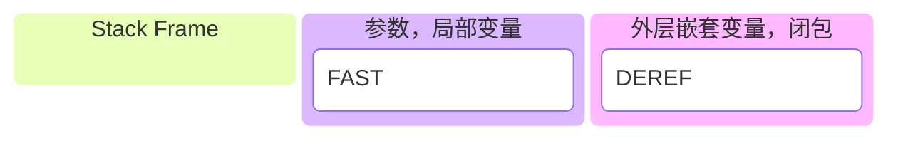

### 函数的创建

Python 函数由两部分组成：**代码对象**和**函数对象**。代码对象包含字节码和指令元数据，负责实际执行；函数对象提供调用接口，管理函数的状态和上下文。

```python
>>> def make(n):
...     ret = []
...     for i in range(n):
...         def test(): print("hello")
...         print(id(test), id(test.__code__))
...         ret.append(test)
...     return ret
...
>>> make(3)
4551723904 4546721840
4551723744 4546721840
4551724064 4546721840
[<function make.<locals>.test at 0x10f4dcb80>, <function make.<locals>.test at 0x10f4dcae0>, <function make.<locals>.test at 0x10f4dcc20>]
```

### 匿名函数

匿名函数与普通函数的主要区别在于，匿名函数只能包含单个表达式，不能包含语句，也不能指定函数名。

```python
>>> add = lambda x, y: x + y
>>> add
<function <lambda> at 0x10f4dccc0>
>>> add(1, 2)
3
```

通过 `dis` 模块，我们可以查看函数的字节码。普通函数和匿名函数在字节码表示上有所不同，匿名函数没有名称，而是用 `<lambda>` 标识。

```python
>>> import dis
>>> dis.dis(compile("def test(): pass", "", "exec"))
  0           0 RESUME                   0
  1           2 LOAD_CONST               0 (<code object test at 0x10efeac10, file "", line 1>)  # 函数有名称
              4 MAKE_FUNCTION            0
              6 STORE_NAME               0 (test)
              8 RETURN_CONST             1 (None)

>>> dis.dis(compile("lambda: None", "", "exec"))
  0           0 RESUME                   0
  1           2 LOAD_CONST               0 (<code object <lambda> at 0x10efe8510, file "", line 1>)  # 匿名函数
              4 MAKE_FUNCTION            0
              6 POP_TOP
              8 RETURN_CONST             1 (None)
```

匿名函数支持嵌套，并且可以形成闭包。

```python
>>> test = lambda x: (lambda y: x + y)
>>> add = test(2)
>>> add(3)
5
>>> add(8)
10
```

### 函数参数签名设计

Python 2 和 Python 3 在函数参数设计上有所不同。Python 3 引入了 `keyword-only` 参数，解决了 Python 2 中的位置参数和关键字参数混用的问题。

**Python 2:**

```python
def printx(sep=",", end="\n", *objects):
    pass

printx(1, 2, 3)  # seq = 1, end = 2, objects = 3
```

**Python 3:**

```python
def printx(*objects, sep=",", end="\n"):
    pass

printx(1, 2, 3)  # objects = (1, 2, 3), sep = ",", end = "\n"
```

### 函数内存结构

每次调用函数时，Python 会创建一个新的栈帧来存储局部变量和执行状态。栈帧在函数执行完成后会被销毁，释放相关资源。

为了提高效率，Python 在栈帧内部使用了两个区域来存储不同类型的变量：

1. **FAST**：存储函数参数、局部变量和函数内部定义的变量， cpython中用作优化。
2. **DEREF**：存储外部作用域的变量和闭包中的变量。



```python
>>> def enclosing():
...     E = "E"
...     def test(a, b):
...         c = a + b
...         print(E, c)
...     return test
... 
>>> t = enclosing()
>>> t.__code__.co_varnames
('a', 'b', 'c')
>>> t.__code__.co_freevars
('E',)
>>> 
>>> import dis
>>> dis.dis(t)
  4           0 LOAD_FAST                0 (a)
              2 LOAD_FAST                1 (b)
              4 BINARY_ADD
              6 STORE_FAST               2 (c)

  5           8 LOAD_GLOBAL              0 (print)
             10 LOAD_DEREF               0 (E)
             12 LOAD_FAST                2 (c)
             14 CALL_FUNCTION            2
             16 POP_TOP
             18 LOAD_CONST               0 (None)
             20 RETURN_VALUE
>>> 
```

### 函数闭包

闭包是指函数离开生成环境后，依然可记住，并持续引用词法作用域里的外部变量。

```python
>>> def make():
...     x = [1, 2, 3]
...     return lambda: print(x)
... 
>>> a = make()
>>> a()
[1, 2, 3]
```

**注：闭包会延长环境变量的生命周期，我们理应慎重使用。**

### 函数调用

当函数被调用时，整个系统核心是被称为解释器(interpreter)的组件。从代码实现来看，就是一个大函数，加一个循环。

解释器运行在系统线程上，字节码指令被解释为内部调用，可依然的参数和返回值需要存储。系统栈用于执行，用户栈存储用户代码执行状态。

当被函数调用时，会传门为其分配用户栈内存。除用来存储变量外，还包含字节码参数和返回值所需的空间。对系统指来说，这里只能存放用户指令数据。这样两方数据互不影响。

```python
>>> def add(a, b):
...     c = a + b
...     return c
... 
>>> import dis
>>> dis.dis(add)
  2           0 LOAD_FAST                0 (a)  # 从FAST读取参数a，压入用户栈
              2 LOAD_FAST                1 (b)  # 从FAST读取参数b，压入用户栈
              4 BINARY_ADD                      # 系统指令从用户栈读取操作数，执行加法操作
              6 STORE_FAST               2 (c)  # 将结果写回FAST

  3           8 LOAD_FAST                2 (c)
             10 RETURN_VALUE

```

我们通常将进程内存分作堆(heap)和栈(stack) 两类：堆可自由申请，通过指针存储自由数据；而栈则用于指令执行，与线程相绑定。

除了通过LEGB规则访问变量，也可以通过栈帧来访问。

```python
>>> def a():
...     x = 100
...     y = 200
...     b()
... 
>>> import sys
>>> def b():
...     f = sys._getframe(1)
...     print(f.f_locals)
... 
>>> a()
{'x': 100, 'y': 200}

```

